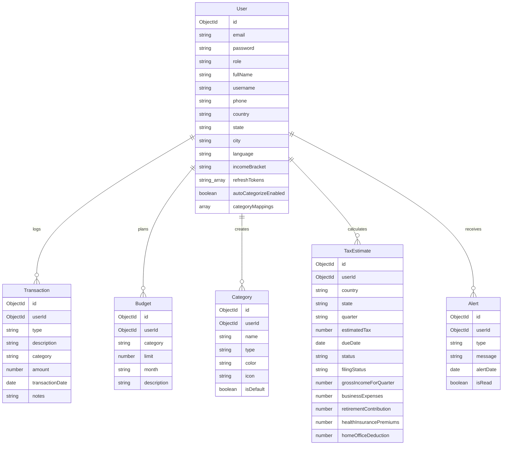

# TaxPal: Personal Finance & Tax Estimator for Freelancers

**TaxPal** is a full-stack, personal finance tracking and tax estimation application built to help freelancers, gig workers, and self-employed individuals manage their finances efficiently. The application enables users to track income and expenses, manage categories, set monthly budgets, monitor real-time spending progress, and dynamically estimate quarterly tax liabilities based on regional tax slabs.

Developed as part of the **Infosys Springboard Internship Program**, TaxPal delivers a premium, secure, and responsive interface using a monorepo setup consisting of a robust Node.js backend and a modern Angular frontend.

---

## 🏗️ Project Architecture & Structure

The repository is organized into two primary project folders:
- **`backend/`**: A Node.js & Express REST API built with TypeScript and MongoDB.
- **`frontend/`**: An Angular client application utilizing Standalone Components, Signal-based state management, and modern CSS styling.

```text
TaxPal-Batch1/
├── backend/                  # Node.js / Express.js Backend API (TypeScript)
│   ├── src/
│   │   ├── config/           # Database configuration, environment schema, logger
│   │   ├── controllers/      # MVC controllers (Auth, Transaction, Budget, Category, TaxEstimate, Alert)
│   │   ├── middleware/       # Route protection, request validation, error handler
│   │   ├── models/           # Mongoose schemas (User, Transaction, Budget, Category, TaxEstimate, Alert)
│   │   ├── routes/           # Express routes mapping endpoints to controllers
│   │   ├── services/         # Business logic & database operations
│   │   ├── types/            # TypeScript interface definitions
│   │   ├── utils/            # Shared utilities (ApiError, ApiResponse, taxCalculator)
│   │   └── validators/       # Zod schemas for request validation
│   ├── .env.example          # Template for backend environment variables
│   ├── package.json          # Backend dependencies and run scripts
│   ├── tsconfig.json         # TypeScript compilation configs
│   └── README.md             # Backend setup & API documentation
│
├── frontend/                 # Angular Frontend Client App
│   ├── src/
│   │   ├── app/
│   │   │   ├── pages/        # Router pages (Login, Signup, Dashboard, Income, Expense, Budgets, Profile, Transactions, TaxEstimator)
│   │   │   ├── services/     # Angular Services (Auth, Api)
│   │   │   ├── app.config.ts # Configuration and provider bootstrapping
│   │   │   ├── app.routes.ts # Frontend navigation routing configuration
│   │   │   └── app.ts        # Main application component
│   │   ├── index.html        # Main HTML layout wrapper
│   │   ├── main.ts           # Frontend app bootstrap file
│   │   └── styles.css        # Global CSS stylesheet (custom dark/light design system)
│   ├── angular.json          # Angular CLI project configurations
│   ├── package.json          # Frontend packages & build scripts
│   └── README.md             # Frontend setup instructions
│
└── README.md                 # Root project documentation (this file)
```

---

## 🚀 Technical Stack

### Frontend
- **Framework**: Angular v20 (Standalone Components & Signals API)
- **Styling**: Vanilla CSS3 (Custom Responsive Layouts, CSS Variables, Theme Toggling, Glassmorphism, and transitions)
- **Data Visualization**: Chart.js (Interactive spending breakdown & transaction analytics)
- **Language**: TypeScript & HTML5
- **Communication & State**: Angular Signals, RxJS, HttpClient, custom HTTP Interceptors

### Backend
- **Runtime & Framework**: Node.js & Express.js (REST API, TypeScript compilation)
- **Database & ODM**: MongoDB & Mongoose (Strict schema enforcement, indexes, and custom virtual fields)
- **Security & Guards**: Helmet.js (Security headers), CORS (with session credentials), Mongo-Sanitize (NoSQL query protection), Express-Rate-Limit (DDoS defense), Zod Validator (Schema verification)
- **Authentication**: JWT (JSON Web Tokens) with Short-lived Access Tokens (15m in HTTP-only cookies) & Rotate Refresh Tokens (7d). Bcrypt password hashing.

---

## 🌟 Key Application Features

1. **Authentication & Security**
   - Secure registration and login flow.
   - Access tokens stored in secure, HTTP-only cookies; automatic session refreshing.
   - Input validations (email correctness, password strength checking with real-time scoring bars, mismatch feedback).

2. **Interactive Financial Dashboard**
   - High-level KPI cards computing **Monthly Income**, **Monthly Expenses**, **Estimated Tax Due**, and **Savings Rate** in real-time.
   - Dynamic charts detailing month-over-month comparisons and category-wise spending.
   - Quick action buttons to immediately record income or expense.
   - Live activity feed showing the most recent transactions with type icons.

3. **Transaction Management**
   - Full CRUD operations to log and edit income/expense transactions.
   - Customized attributes including transaction descriptions, date pickers, values, custom category maps, and additional notes.

4. **Smart Auto-Categorization Engine**
   - Intelligent keyword-matching algorithm that suggests the most appropriate category based on the transaction description (e.g., `uber` -> `Travel/Meals`, `aws` -> `Software/SaaS`, `ads` -> `Marketing/Ads`, `laptop` -> `Hardware/Gadgets`).

5. **Category-Based Budgeting**
   - Set spending limits per category per month.
   - Automatic background calculations checking spent aggregates against budgeted limits.
   - Dynamic visual warning notifications (safe spending, near-limit alerts, over-budget indicators).

6. **Tax Estimator Module**
   - Select country/region and state of residence.
   - Compute quarterly tax liabilities based on regional tax slabs.
   - Factor in gross quarterly revenues, business expenses, retirement contributions, health insurance premiums, and home office deductions.

7. **Reminder & Alert Notification System**
   - Log automated alerts for upcoming tax deadlines.
   - Dynamic calendar interface detailing payment schedules and tax savings suggestions.

---

## 📂 Database Schema Overview



---

## 🔑 Core API Endpoints

### Authentication & Profile (`/api/auth`)
- `POST /register`: Registers a new user account.
- `POST /login`: Authenticates user, signs JWTs, and sets secure HTTP-only cookies.
- `POST /refresh`: Rotates and issues new access/refresh tokens.
- `POST /logout`: Revokes user tokens and clears cookies.
- `GET /profile`: Fetches current logged-in user profile attributes.
- `PUT /profile`: Updates user profile settings (name, country, income bracket, etc.).

### Transaction Management (`/api/transactions`)
- `POST /`: Log a new transaction (Income or Expense).
- `GET /`: Retrieve all transactions for the authenticated user (supports filtering).
- `GET /:id`: Retrieve transaction details by ID.
- `PUT /:id`: Update transaction details.
- `DELETE /:id`: Delete a transaction record (re-computes dashboard cards instantly).

### Category Budgets (`/api/budgets`)
- `GET /`: Retrieve category budgets and calculate spent totals for the current month.
- `POST /`: Set or update a budget limit for a category.
- `DELETE /:category`: Remove a budget entry.

### Category Configuration (`/api/categories`)
- `GET /`: Fetch custom user categories.
- `GET /type/:type`: Fetch categories filtered by type (`income` or `expense`).
- `POST /`: Create a new custom category with hex color and icon class.
- `PUT /:categoryId`: Modify custom category configurations.
- `DELETE /:categoryId`: Remove custom category.
- `POST /initialize-default`: Seed initial standard categories.

### Tax Estimation (`/api/tax-estimates`)
- `GET /`: Retrieve list of all tax estimations.
- `POST /`: Save a quarterly tax estimation calculation.
- `GET /:id`: Get specific tax calculation details.
- `PUT /:id`: Edit recorded tax calculation variables.
- `DELETE /:id`: Delete a tax estimate.

### Alert Notifications (`/api/alerts`)
- `GET /`: Retrieve notifications and reminder status.
- `POST /`: Manually create/test an alert entry.
- `PUT /:id/read`: Mark an alert as read.
- `DELETE /:id`: Dismiss/delete an alert.

---

## 🏆 Current Project Milestones Status

- **`[x]` Milestone 1: Transaction Logging**
  - Completed register/login auth workflow.
  - Setup core dashboard components and financial KPI cards.
  - Implemented manual transaction entry forms.
- **`[x]` Milestone 2: Categorization & Budgeting**
  - Completed Category CRUD and default seeding configurations.
  - Configured smart keyword auto-suggest logic.
  - Added monthly budget trackers and progress visualization meters.
- **`[x]` Milestone 3: Tax Estimation**
  - Integrated regional tax engine supporting custom deductions (Home Office, Health Insurance, etc.).
  - Added quarterly estimation records.
  - Integrated Interactive Calendar view and due-date alerts.
- **`[ ]` Milestone 4: Reporting & Export**
  - *Status: Planned Next Stage.*
  - Requirements: Generate and download summary financial reports. Monthly/quarterly summaries, PDF & CSV export capabilities.

---

## ⚙️ Getting Started & Setup

### Prerequisites
- **Node.js** (v18.x or above recommended)
- **MongoDB** running locally (`mongodb://localhost:27017`) or a **MongoDB Atlas Cloud Connection URI**

### 1. Backend Server Setup
1. Open a terminal and navigate to the backend directory:
   ```bash
   cd backend
   ```
2. Install npm dependency modules:
   ```bash
   npm install
   ```
3. Configure environment parameters by copying `.env.example` to `.env`:
   ```bash
   cp .env.example .env
   ```
   Provide your local credentials:
   ```env
   PORT=5000
   MONGODB_URI=mongodb://localhost:27017/taxpal
   JWT_SECRET=your_jwt_access_secret_key
   JWT_EXPIRES=15m
   REFRESH_SECRET=your_jwt_refresh_secret_key
   REFRESH_EXPIRES=7d
   NODE_ENV=development
   ```
4. Start the API server in development mode (hot reloads via nodemon):
   ```bash
   npm run dev
   ```
   *The server runs at: `http://localhost:5000`*

### 2. Frontend Angular Setup
1. Open a new terminal and navigate to the frontend directory:
   ```bash
   cd frontend
   ```
2. Install client dependency packages:
   ```bash
   npm install
   ```
3. Start the Angular local development server:
   ```bash
   npm start
   ```
   *The client app boots and is accessible at: `http://localhost:4200`*


---

## 👥 Development Team

Developed as part of the **Infosys Springboard Internship Program** by:
- **Team Leader**: K Sujay
- **Backend Team**: Rohith, Dhanshri
- **Frontend Team**: Afsana, Gowthami
